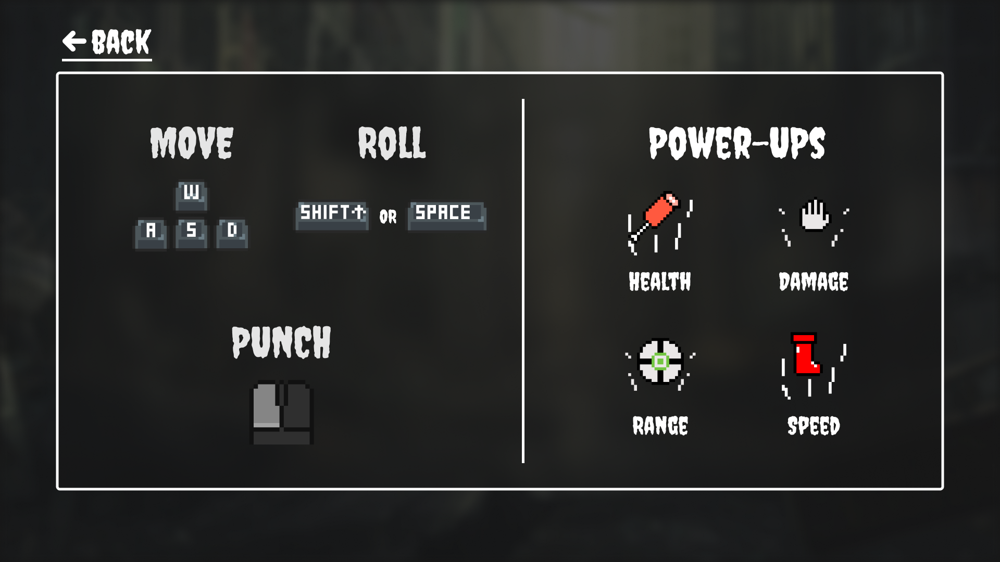
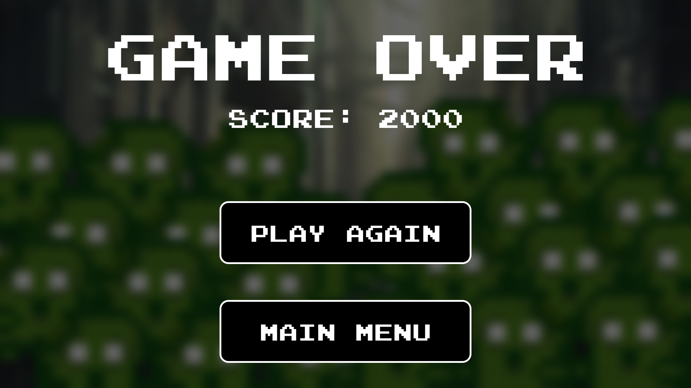

# Project Progress Report

## Authors Information

- Name: Jason Ma
- GitHub: [https://github.com/JasonBMa](https://github.com/JasonBMa)
- Name: Eric Barron
- GitHub: [https://github.com/ericbarron329](https://github.com/ericbarron329)
- Name: Keith Low
- GitHub: https://github.com/keith-loww
- Name: Humza Muhammad
- GitHub: [https://github.com/cabatchi](https://github.com/cabatchi

## Main Roles

### Producer (Humza Muhammad)
The producer coordinates the technical dependencies and basic team logistics. Responsibilities include but are not limited to creating a dependency chart for the significant development tasks for the game, coordinating team meetings, working with the other roles to integrate their work into the main project, deciding on the Git-based workflow (i.e. how everyone's work gets combined into release branches without breaking the project), and organizing the final presentation.
While this role has fewer direct programming responsibilities, it requires understanding all parts of the development process. When performed well, the producer multiplies the effort of the entire team, which results in a better game project.
As I wasn’t very confident in my abilities to code anything that would help us develop a game due to my extremely lackluster performance on the solo personal projects, I decided to take on whatever roles, both main and sub, that no one wanted. After everyone chose their roles, the only two roles that remained were the Producer role and the Gameplay Tester role. I wasn’t exactly sure what that would entail. Before anyone had actually chosen their roles, I made a when2meet for all of us to fill out in order to figure out the best time for all of us to hop on call and talk about what we would like to do for our game, as my availability was limited due to constantly being sick as well as having to work right after class on the days I wasn’t sick. I guess I was already doing “Producer” things even then. 
The first things I did in the role was create a Trello board 
which we used for a little bit before deciding it was probably just a better idea to update each other in the groupchat on what we were doing and what needed to be done. 

*A Trello Board! We used it for a bit then realized it wasn't too convenient*

I then created a design document, which we sort-of used.

I also created the GitHub Repository, and took the responsibility of making sure there weren’t any discrepancies whenever someone tried to merge. At some point, we had over 20 branches. I’m not too well-versed in GitHub but this seemed to be a very learn-on-the-job type thing for me. 

*So many branches!*

As I wasn’t too confident in my coding abilities, and the Producer role seemingly had no code-related obligations, I decided to try to help whoever needed help in the group with whatever. I made a few assets, a gun (very early on)  and a fist (may be hard to see on a white background) after getting inspired by the GDAC. We didn’t end up using these but I felt a little better knowing I did something at least.

*Gun model that we ended up not using*

*Fist model we ended up not using* 

As the producer, I also took responsibility for setting up the peer-review sessions between us and the different groups we were assigned to. I set up the peer review documents that we were using, and had to work with both teams, and at one point, everyone on the other team, in order to make sure that the peer reviews were finished by both parties, something that was very stressful for me. 
I helped a little bit more in the assets department, helping Jason make the wizard, archer, and bloody zombie sprites, but again, I had barely helped with anything code-related.
The only code-related things I ended up doing was implementing a money system, as someone in the group suggested it after we showed the game off.
Admittedly, I feel like I was dead weight for the team and didn’t work anywhere near as hard as anyone else, which is probably accurate for someone in a “management” role.

### User Interface and Input (Keith Low)

#### User Interface

When drafting up my initial designs for the User Interface, I wanted to achieve a balance between two thematic influences:

- **Arcade Aesthetic:** The UI aimed for a clean and uncluttered visual style, reminiscent of classic arcade games. This focus on clarity ensured that players could easily understand and interact with the interface.
- **Zombie Theme Integration:** To reinforce the game's "zombie" theme, the color palette leaned towards a darker and greyer range, subtly setting the atmosphere.

##### Main Menu

The first screen I designed was the Main Menu screen. Below you can see all the ideations of the design. Starting with the basic layout, I eventually added a background, custom fonts, recolored the buttons, and enlarged the Zombie Toast sprite.

Eventually, I settled on the design below.

I also needed to create a simple “How to Play” screen, which would just serve as a toggle overlay on the main menu. Here are the iterations of the design of this screen.

Eventually, I settled on the design below:

Both the main menu and its interactive elements were implemented within a single scene named "Main Menu." This scene facilitates:

- **Game Start:** Clicking the "Punch" button triggers a scene transition to the main game.
- **Tutorial Access:** The "How To Play" button activates an overlay containing tutorial information.
- **Game Exit:** The "Exit" button gracefully terminates the game.

The [`MainMenu`](https://github.com/cabatchi/ECS179zomPunch/blob/65f84c3d5659cd392ddd2f216ee25a857c4a26a6/Assets/Scripts/MainMenu.cs#L4) class serves as the central controller for this scene, managing all its functionalities. Additionally, it uses a [`SoundManager`](https://github.com/cabatchi/ECS179zomPunch/blob/65f84c3d5659cd392ddd2f216ee25a857c4a26a6/Assets/Scripts/SoundManager.cs#L13) to play the theme music.

##### Game Over Screen

Mirroring the Main Menu approach, the game over screen was initially designed in Figma. The design process prioritized conveying a feeling of being overwhelmed by the relentless horde. This sentiment was achieved through the strategic use of a multitude of zombie-toast sprites populating the background.

**Mockups:**

Finally, I decided on this design:

Side note: The [`PlayerController`](https://github.com/cabatchi/ECS179zomPunch/blob/65f84c3d5659cd392ddd2f216ee25a857c4a26a6/Assets/Scripts/PlayerController.cs#L6) is responsible for detecting player death. Upon such an event, it signals the [`GameManager`](https://github.com/cabatchi/ECS179zomPunch/blob/65f84c3d5659cd392ddd2f216ee25a857c4a26a6/Assets/Scripts/GameManager.cs#L5) to initiate the game over sequence. This sequence involves:

- **Screen Fade:** The `GameManager` fades the screen to black, creating a clear transition.
- **Scene Change:** The `GameManager` transitions the scene to the dedicated "Game Over" scene.

Similar to the Main Menu, the "Game Over" scene is managed by a central controller, the [`GameOverController`](https://github.com/cabatchi/ECS179zomPunch/blob/65f84c3d5659cd392ddd2f216ee25a857c4a26a6/Assets/Scripts/GameOverController.cs#L5) acts as a general controller that handles all of this. This controller oversees:

- **Interactive Elements:** The controller handles the functionality of the two buttons presented in the scene:
  - "Play Again": Clicking this button triggers a scene change back to the main game, allowing the player to restart.
  - "Main Menu": This button transitions the scene to the main menu, providing the option to return to the title screen.
- **Audio Cues:** The `GameOverController` leverages the [`SoundManager`](https://github.com/cabatchi/ECS179zomPunch/blob/906c5bc17b5905414707318f5f8bbf997518b138/Assets/Scripts/SoundManager.cs#L13) to play the game over music, setting the appropriate audio mood.

##### HUD

###### Healthbar

**Mockups:**

**Final assets:**

In keeping with the game's "food poisoning" theme, the health bar utilizes meat-sticks instead of the conventional hearts. The [`Health`](https://github.com/cabatchi/ECS179zomPunch/blob/906c5bc17b5905414707318f5f8bbf997518b138/Assets/Scripts/Health.cs#L4) class manages this health bar, handling the following:

- **Health Tracking:** Stores the player's current health value.
- **Visual Feedback:** Updates the appearance of the meat-sticks to visually represent health deterioration. As the player takes damage, a certain number of meat-sticks become visually "poisoned" (presumably changing color or appearance). There are a total of five meat-sticks, and once all are poisoned, the game ends.

###### PowerUps Display

**Mockups:**

**Final:**

The PowerUp HUD is overseen by the [`PowerUpsDisplayController`](https://github.com/cabatchi/ECS179zomPunch/blob/906c5bc17b5905414707318f5f8bbf997518b138/Assets/Scripts/PowerUpDisplayController.cs#L3). This controller maintains communication with the [`PlayerPowerUpsController`](https://github.com/cabatchi/ECS179zomPunch/blob/906c5bc17b5905414707318f5f8bbf997518b138/Assets/Scripts/PlayerPowerUpsController.cs#L4) to ensure the displayed numerical values accurately reflect the player's current power-up inventory.

The [`PlayerPowerUpsController`](https://github.com/cabatchi/ECS179zomPunch/blob/65f84c3d5659cd392ddd2f216ee25a857c4a26a6/Assets/Scripts/PlayerPowerUpsController.cs#L4) keeps track of the number of each power-up the player possesses throughout the game. It leverages an enum, [`PowerUpType`](https://github.com/cabatchi/ECS179zomPunch/blob/65f84c3d5659cd392ddd2f216ee25a857c4a26a6/Assets/Scripts/PlayerPowerUpsController.cs#L25), to categorize the different power-up types. This approach ensures clarity regarding the specific power-up type being added to the count, promoting the creation of more general-purpose functions. By using an enum, the code becomes more readable and maintainable as the set of possible power-ups is explicitly defined.

###### Misc: Score, Money, Waves, Zombies

All these misc. values on the HUD can be seen in this screenshot.

- Score is is tracked via the [`ScoreManager`](https://github.com/cabatchi/ECS179zomPunch/blob/b0f94dbd989922021ae601d21ab36ce47c2f4c42/Assets/Scripts/ScoreManager.cs#L3) which can be found in the `GameManager` object. It is responsible for both:
  - Storing the score value such that it can be accessed in the “Game Over” scene
  - Updating the text representing the score.
    The `ScoreManager` also provides some methods to allow certain events, such as killing a zombie, to modify the score value.
- Money is tracked in a very similar way as score, using the [`MoneyManager`](https://github.com/cabatchi/ECS179zomPunch/blob/b0f94dbd989922021ae601d21ab36ce47c2f4c42/Assets/Scripts/MoneyManager.cs#L3).
- The remaining zombies and wave counter display is controlled with [`ShowWave`](https://github.com/cabatchi/ECS179zomPunch/blob/b0f94dbd989922021ae601d21ab36ce47c2f4c42/Assets/Scripts/ShowWave.cs#L6) which counts up the remaining zombies and the wave number by accessing the [`ZombieSpawner`](https://github.com/cabatchi/ECS179zomPunch/blob/b0f94dbd989922021ae601d21ab36ce47c2f4c42/Assets/Scripts/ZombieSpawner.cs#L5) class methods.

##### Store

**Mockups:**

**Final Design:**

Embracing our design philosophy, the final store mockup features an arcade-inspired, minimalist UI that clearly communicates purchasable power-ups at displayed prices. Additionally, it incorporates a helpful prompt at the bottom, guiding players on initiating the next wave.

The Store functions as a hidden panel that activates after each wave concludes. The [`ItemShop`](https://github.com/cabatchi/ECS179zomPunch/blob/65f84c3d5659cd392ddd2f216ee25a857c4a26a6/Assets/Scripts/ItemShop.cs#L5) class manages this behavior, detecting wave completion signals from the [`ZombieSpawner`](https://github.com/cabatchi/ECS179zomPunch/blob/65f84c3d5659cd392ddd2f216ee25a857c4a26a6/Assets/Scripts/ZombieSpawner.cs#L5) class. Upon receiving such a signal, `ItemShop` triggers the Store panel to appear.

Within the Store, the `ItemShop` class governs button interactions. When a button is pressed, the corresponding power-up equips to the player, and the price for that power-up increases.

Side note: The [`InputController`](https://github.com/cabatchi/ECS179zomPunch/blob/65f84c3d5659cd392ddd2f216ee25a857c4a26a6/Assets/Scripts/InputController.cs#L3) maintains awareness of the Store's open/closed state. When the Store is open, the `InputController` restricts specific inputs, like punching attacks. Conversely, it grants the player the ability to close the Store, introducing a new input action specific to this context.

##### Pause Menu

**Mockups:**

**Final Assets:**

Incorporating thematic elements, the pause menu features bite marks and chips, enhancing its visual appeal and reinforcing the game's atmosphere.

The [`PauseMenuController`](https://github.com/cabatchi/ECS179zomPunch/blob/65f84c3d5659cd392ddd2f216ee25a857c4a26a6/Assets/Scripts/PauseMenuController.cs#L4) governs the pause menu, which functions as a hidden panel. This controller handles several key actions:

- **Menu Toggling:** The controller toggles the visibility of the pause menu and its accompanying overlay. This overlay prevents players from accessing the shop while the game is paused.
- **Game Pausing/Resuming:** The controller manages the game clock, enabling the paused-game state by stopping and resuming the clock as needed.
- **Button Actions:** The controller oversees button functionality within the pause menu. Buttons offer options to resume the game or exit to the main menu.

Side note: The [`InputController`](https://github.com/cabatchi/ECS179zomPunch/blob/65f84c3d5659cd392ddd2f216ee25a857c4a26a6/Assets/Scripts/InputController.cs#L3) remains active during the paused state. However, it restricts all inputs except the "ESC" key, which serves as the designated pause menu toggle.

#### User Input

This game utilizes a mouse and keyboard interface for user input. The `GameManager` object houses the [`InputController`](https://github.com/cabatchi/ECS179zomPunch/blob/906c5bc17b5905414707318f5f8bbf997518b138/Assets/Scripts/InputController.cs#L3), responsible for managing all player inputs and the corresponding logic dictating when specific inputs are allowed.

**Benefits of a Centralized `InputController`:**

- **Decoupling:** Employing a single `InputController` fosters a separation between user inputs and the classes they interact with. This promotes cleaner code structure.
- **Improved Visualization:** Centralizing input logic within the `InputController` simplifies visualizing all available user inputs and the underlying logic in one location.
- **Future-Proofing:** This approach facilitates the potential future implementation of key remapping functionality.

### Game Logic (Eric Barron)

#### Eric's Implementation

My role was responsible for creating the core mechanics of the game. From the start, our team wanted to create a top-down zombie survival game. We started with the regular zombie and soon branched out to have different types of zombies chasing the player. Our approach was to have a dynamic range of mobs the player could fight.

The magic and archer zombies have unique features in approaching the player. They will chase the player until they get too close, then will start to back up. This was added to give a realistic feel as the ranged mobs would want to keep their distance from the player.

Features added:

The core mechanic of the game is centered around zombies. There are multiple types of zombies that spawn from the same regions. Regular zombies run at the player while range-based zombies will back up if the player gets too close.

[Zombie Spawnwer](https://github.com/cabatchi/ECS179zomPunch/commit/7dcbfec3710a64839ab3d0a966df419287858418)

[Regular Zombie](https://github.com/cabatchi/ECS179zomPunch/commit/7dcbfec3710a64839ab3d0a966df419287858418#diff-e89292b67e46d1f25eaeb808ae9e86eb3a191485c6ada3a9d4da5900e2edbf88)

[Archer Zombie / Magic Zombie](https://github.com/cabatchi/ECS179zomPunch/commit/4790c17b77de2470567769c2ff9af91461b74b44)

[Giant Zombie](https://github.com/cabatchi/ECS179zomPunch/commit/bbf303701e1e2e83403fa7b2c4654a0ac9663cc9)

[Zombie Collisions](https://github.com/cabatchi/ECS179zomPunch/commit/26df3f106e954a96dd8f937b5cc8008450c0458d)

Player and enemy attacks were created to add a PvE system into the game. Centered around projectiles, both the player and the enemy can shoot at each other. Homing bullets and projectiles can damage the player while the player can shoot back with a punch animation. The bullet script has a fixed position around the player so the player can point and shoot in their desired direction. Furthermore, scripts like the homing bullet are tailored to lock on to the player and chase them for a set amount of time.

[BulletScript / PlayerAttack](https://github.com/cabatchi/ECS179zomPunch/commit/25ddafff892854b014f7a91a2bf5423192b39c35)

[EnemyProjectile / HomingBullet](https://github.com/cabatchi/ECS179zomPunch/commit/4790c17b77de2470567769c2ff9af91461b74b44#diff-df9197a964300c0605722f384d4791007ce1a6a82b8eace72f9f260132185610)

Powerups and Item shop features were implemented to give the player a replayable aspect of the game. Upgrading and increasing stats make the game more enjoyable as the player can get to high rounds.

[ItemShop](https://github.com/cabatchi/ECS179zomPunch/commit/2d5de45e70f8d4a8eb42f60e3f7583072215dd55)

[PouwerupEffect / HealthBuff](https://github.com/cabatchi/ECS179zomPunch/commit/41b52287a8e4c9bcdb3d73896ef2a057e2834659)

[DamageBuff](https://github.com/cabatchi/ECS179zomPunch/commit/e85ecf236ae526957ac8e1b558745e3b1424ff28)

[RangeBuff](https://github.com/cabatchi/ECS179zomPunch/commit/d953fce85a49cb0a437154523746d9b7daf837d8)

#### Jason's Implementation in Game Logic

- Created Power Up Spawner that spawns a power up after every wave.
  - Generates a randomly selected power up `Health`, `Damage`, `Speed`, `Range`.
  - Plays a sound queue and a indicator of what the power up upgrade for the player.
- `PlayerController parts` Created a Player States for the Player Controller, to keep track of what the player could and could not do within each state `Normal`, `Rolling`,`Stunned` ,`Dead`.
- `ZombieController parts` Handled collision with Zombies
  - Altered the collision hit box to be accurate.
  - Insured that the zombies would only do damage when the zombie was alive and not in death animation.

### Movement/Physics (Jason Ma with help from Eric Barron)

#### Implemented player movement mechanics:

- `WASD` for directional movement.
- `Space/Shift` for Rolling.
  - Rolls in the direction of the current player input `(W,A,S,D)` have to be pressed with `Space/Shift`
  - Utilized Lerping to smooth out rolling speed.
  - Has a timer incase the player gets stuck in the `Rolling` state

#### Implemented zombie movement mechanics:

Flocking/Seperation making the zombies not group up too close with each other, creating more of a threat and avoids stacking/overlaying sprites.

#### Collision

- Eric started and designed the collision between the sprites and map.
- Eric checked for out of bound rolling, and insured player didn't roll out of the map.
- Jason moved and tweaked map later on based off of bugs and issues that arose.

### Animations and Visuals (Nicholas Phan and Jason Ma)

In this project, went with the theme of "Rolling with the punches" and decided to create a game with two main mechanics: `Punching` and `Rolling`.

_The Normal Zombies: _  

_The Giant:_  

_The Archer:_  

_The Mage:_  

We took the original [asset](https://lhteam.itch.io/zombie-toast) and edited the sprite itself to create variations of what we want in terms of enemies, Jason was the one that designed the Enemy Variants.

#### Animator and Animation Implementation (Jason)

- Added animator controllers, and setting up animations
  - Player, included animations of `Idle`, `Walking`, `Rolling`
  - Zombies, included animations of `Idle`, `Walking`, `Dying`
    - **Default**
    - **Archer**
    - **Wizard**: Contains a `Attack` animation
    - **Giant**
  - Power Ups Pick Ups
    - **Health**
    - **Damage**
    - **Speed**
    - **Range**
  - Also created a animation for pop up text indicating to the player what power is picked up and it's use. 
    

### Art Direction (Nicholas Phan)

I designed and created the TileMap that we would use for our game, as well as Player sprite and powerups. I started by creating some test sprites in 16x16. The choice was essentially creating a 2D pixel game and I ended up just making it 16x16 and held to it.

The Test Sprites I made are shown here, I went with a simple stick figure design so that way the team would be able to have some visuals to work with while they programmed the general gameplay.

Here I created a simple set of animations regarding the four main characteristics of the player: Walking, Rolling, Punching, and Idle.

| Idle                                                                                                                                                                                                                                   | Walking                                                                                                                                                                                                                                 | Punching                                                                                                                                                                                                                                          | Rolling                                                                                                                                                                                                                                   |
| -------------------------------------------------------------------------------------------------------------------------------------------------------------------------------------------------------------------------------------- | --------------------------------------------------------------------------------------------------------------------------------------------------------------------------------------------------------------------------------------- | ------------------------------------------------------------------------------------------------------------------------------------------------------------------------------------------------------------------------------------------------- | ----------------------------------------------------------------------------------------------------------------------------------------------------------------------------------------------------------------------------------------- |
|  |  |  |  |

We had then took a different approach: The punching. We had decided to create the game to where we could actually aim the punches just like how you would in a pixel based shooter, kinda like [Enter The Gungeon](https://store.steampowered.com/app/311690/Enter_the_Gungeon/). After finalizing our aesthetics and game ideas, I had then changed the sprites to it's finalized design, and ended up not needing to create an attacking animation. Note: all of this was made possible using the online free tool: [Piskel](https://www.piskelapp.com/)!

| Idle                                                                                                                                                                                                                                   | Walking                                                                                                                                                                                                                                  | Rolling                                                                                                                                                                                                                                 |
| -------------------------------------------------------------------------------------------------------------------------------------------------------------------------------------------------------------------------------------- | ---------------------------------------------------------------------------------------------------------------------------------------------------------------------------------------------------------------------------------------- | --------------------------------------------------------------------------------------------------------------------------------------------------------------------------------------------------------------------------------------- |
|  |  |  |

#### Map Design (Nicholas Phan and Jason Ma)

For Map Design, we wanted to use the quad as our main map to where we would hold the player to survive in. I had some previously made tiles made for a previous personal project and was able to reuse the assets there. I also had to draw a couple other new things, such as Tables to be borders for the player to not pass over, miscellaneous trash and blood(Jam) on the floor, and had also created the legendary blue hammocks for near the quad for peoeple. I had used a free software known as [Tiled](https://www.mapeditor.org/) to create the tile map, however, there were size errors with my created map (Resolution errors, way too small). Luckily, Jason was able to redesign the map with the given tile map, and created this beautiful design of a post apocolyptic quad:

Original map design from Nick:

Jason's design:

Here is my original tileset that I had made from scratch: 

Jason created starter map for testing meanwhile the Nick was developing our tileset, so we could start testing and implementing features of the game.

Along with this, we had also used [“Clockwork Raven – Additional Art Assets”](https://clockworkraven.itch.io/raven-fantasy-pixel-art-tileset-green-forest) to use along our maps to create the tree's within the environment, as my art skills are very limited. License for this asset is attached [here](https://drive.google.com/file/d/1DWGfcVE5nXsAkaPgqfGqf0lwesv6ug3N/view).

#### Power Ups (Nicholas Phan)

We had decided to create a sense of Scaleability in the game by implementing powerups! We have these powerups scale the user's stats via a multiplicative value, and allowed for the players to have freedom of creating a build to last against these zombies! I was in charge of drawing the powerups and as a group, agreed that we would have four powerups: Health, Damage, Range, and Speed!

##### Below are the PowerUps!

| Health                                                                                                                                                                                                                                         | Damage                                                                                                                                                                                                                                 | Range                                                                                                                                                                                                                                        | Speed                                                                                                                                                                                                                                         |
| ---------------------------------------------------------------------------------------------------------------------------------------------------------------------------------------------------------------------------------------------- | -------------------------------------------------------------------------------------------------------------------------------------------------------------------------------------------------------------------------------------- | -------------------------------------------------------------------------------------------------------------------------------------------------------------------------------------------------------------------------------------------- | --------------------------------------------------------------------------------------------------------------------------------------------------------------------------------------------------------------------------------------------- |
|  |  |  |  |

I chose to use these icons as a way to represent the given stats as I felt like it was easy for players to understand! Meat = Health, Hand = Damage (cause they got hands), Crosshair for range (though it can be confused for a shield), and Red Boots for speed!

## Sub Roles

### Game Feel (Jason)

- Made sure the whole death animation plays for zombies.
- Accurately/ Modified placed collisions, so players weren't getting collided with the air.
- Made the player blink red, as it was confusing when the player was taking damage.
- Added hold down `Mouse1/Fire1`, as player was having to manually spam to kill enemies.
- After testing, we found zombies getting stuck. Decided to change the map to stop choke points where zombies commonly got stuck.
- Added Pick up sound and Indicator to pick ups as it was confusing what the pick ups upgraded. The pickup sound creates a more auditory and responsive gameplay.

### Audio (Nicholas Phan)

In order to control the sounds in the game, we utilized the `SoundManager.cs` from [exercise 1](https://github.com/dr-jam/CommandPatternExercise) and was able to implement sounds and music for the game. I created a global `GameObject` as a way to make a similar object hierarchy that the exercises did to maintain audio, and would have the audio play on specific key events such as: When the player punches, when zombies spawn (little toaster dings), when players pick up a powerup, etc.

For Audio choices, I found primarily royalty free music and took sound effects from other games and media to support what we wanted.

#### Music (Nicholas Phan)

For Zompunch I found two songs that were Royalty Free and decided it fit the theme of the game. The songs are ["Royalty Free Heavy Metal Instrumental - Game Over - Jacob Lizotte"](https://www.youtube.com/watch?v=DpxZ5PHa6xo) and ["Violent Zombie Annihilation Music Bed of Razors Royalty Free No Copyright Music"](https://www.youtube.com/watch?v=VjFMP9KcqOU)

#### SFX (Nicholas Phan)

For sound effects, we had a couple of scrapped sounds that we didn't use, but for the most part we have sound effects that focus on the Punch, the spawning of zombies, and the powerups!

Here is the [Punch Sound](https://www.youtube.com/watch?v=lwYL2vs9HL4) and the
[Round Start Sound](https://www.youtube.com/watch?v=KS85lRtQ_pk) for the toasts. I picked this specific punch sound as it allows for a sense of "Power" within the punch, and for the round start sound, I thought it would fit the theme of how the toasts are spawning out of a toaster!

For the [Powerup Sound](https://pixabay.com/sound-effects/), we got it off this website as it allows for royalty free use.

### Gameplay Testing (Humza Muhammad)

The majority of testers seemed to really enjoy the way that the game felt to play, but were hoping for more of a difficulty spike rather than what we had implemented. Also, a large portion of them reported dying to bugs, or things that were straight-up-unfair, such as difficult-to-see projectiles, than anything that could be described as “fair.” A lot of people gave feedback at the in-person event, but they didn’t fill out a form. However, they seemed to have a lot of the same concerns. Game felt good, but there were some bugs that seemed to take away from the experience, not a lot, but enough to the point where it got a little annoying. 

### Narrative Design (Eric Barron and Nicholas Phan)

Talking with Eric about the Narrative design, we ended up going for a post-apocalyptic UC Davis, where a mysterious Food Poisoning disease called "Toast-Vid 19" had spread throughout the campus. Upon this disease spreading, it created a spiral of transformations of UC Davis Students, morphing them into different classes of "Toast Zombies"

Our design around a UC Davis toast outbreak allowed us to create all assets around the toast prefab. Most of the other teammates helped with the narrative design including the SFX / Audio / Music / Art. Since my main role was Game Logic, most of my narrative design implementations focused on creating the game's assets.

[Zombie Creation](https://github.com/cabatchi/ECS179zomPunch/commit/7dcbfec3710a64839ab3d0a966df419287858418) - Creating the Zombies and Spawners

### Press Kit and Trailer (Keith Low)

**Press Kit: [https://keith-loww.github.io/zompunch-press-kit/](https://keith-loww.github.io/zompunch-press-kit/)**

To align the press kit with the game's theme, I opted for a custom website built using Figma mockups. This approach ensured a cohesive visual experience between the press kit and the game itself.

The selected screenshots served to comprehensively showcase the core aspects of the game:

- **User Interface:** Screenshots of the main menu and the item store provided viewers with a clear understanding of the game's interface and navigation.
- **Visual Style:** The inclusion of a screenshot highlighting the tile-set effectively communicated the game's visual aesthetic.
- **Enemy Variety:** Screenshots featuring different enemy types offered a glimpse into the range of adversaries players will encounter.
- **Gameplay Core:** The inclusion of the game over screen provided context for the overall game flow.

In addition to the foundational elements, screenshots depicting the player swarmed by numerous zombies effectively conveyed the game's core mechanic - a "one vs. many" survival experience where players must overcome overwhelming odds.

**Trailer: [https://www.youtube.com/watch?v=E4mrN1o4A_c](https://www.youtube.com/watch?v=E4mrN1o4A_c)**

The game trailer prioritizes establishing the dark, apocalyptic atmosphere of the game. To achieve this, the trailer leverages the main theme music, which effectively sets the tone from the outset. The trailer's opening sequence is designed to quickly immerse viewers in the protagonist's situation, further amplifying the overall tone.

The core gameplay mechanics are presented through carefully selected snippets. These snippets highlight:

- **Movement:** The player character's agility and movement capabilities are showcased.
- **Combat:** Viewers get a glimpse of the punching mechanic, a core offensive option.
- **Evasion:** The trailer incorporates clips demonstrating the "rolling" mechanic, used to skillfully evade enemy attacks.

Beyond the basics, the trailer expands its scope by showcasing additional elements:

- **Variety of Enemies:** Clips featuring different enemy types pique the viewer's interest and hint at the range of challenges to overcome.
- **Strategic Resource Management:** The inclusion of the shop scene subtly introduces the concept of acquiring power-ups to enhance the player's chances of survival.
- **Chaotic Encounters:** Action-packed gameplay sequences effectively convey the overwhelming nature of the game's "survival" aspect.

By emphasizing the "play again" aspect in the trailer, the goal is to highlight the game's "arcade-like" qualities, encouraging players to anticipate multiple playthroughs and hone their skills.
